# YelpCamp_Project
My Version of YelpCamp- from the Web Developer Bootcamp 2022 by Colt Steele: https://www.udemy.com/course/the-web-developer-bootcamp/

YelpCamp allows users to create/review campgrounds, In order to create or review campgrounds users must have an account.

This Project was created using Node.js, Express, MongoDB, Bootstrap and Passport.js to handle authentication.

Website deployed on Heroku: https://damp-bastion-63286.herokuapp.com/

## Features
* Users can create, edit, remove campgrounds.
* Allows users to review campgrounds and remove their reviews.
* User profiles display more information about the user such as (Full name, email, avatar), it also displays the # of campgrounds (with links to them) and the # of reviews the user has submited, also includes the option to edit their profile or delete their account.
* Option to make users have the role of administrator 
* Option to search by name or location.

## To Run it locally
1. Install MongoDB
2. Create a cloudinary account and get API Key and Secret code
3. Create a .env file and add the following:

```

CLOUDINARY_CLOUD_NAME= <name>
CLOUDINARY_API_KEY= <key>
CLOUDINARY_API_SECRET= <secret key>
MAPBOX_TOKEN= <token>
DB_URL=<url>
ADMIN_SECRET=<secret code>

```

Run ```mongo``` in onother therminal and ```node app.js ``` in the terminal with the project.
Then go to [localhost:3000]


## Gallery

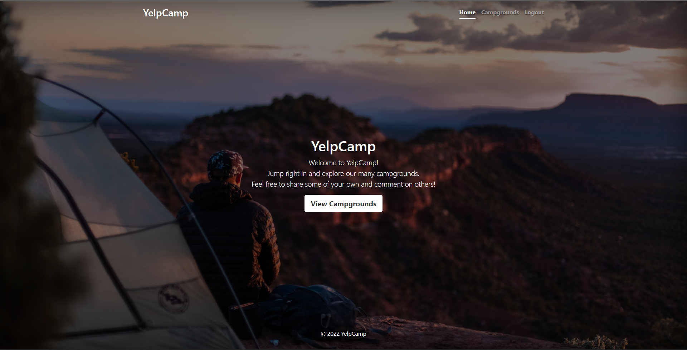

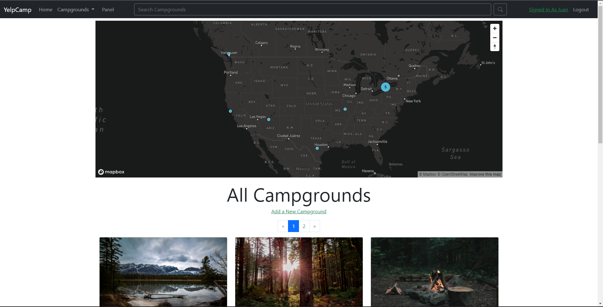

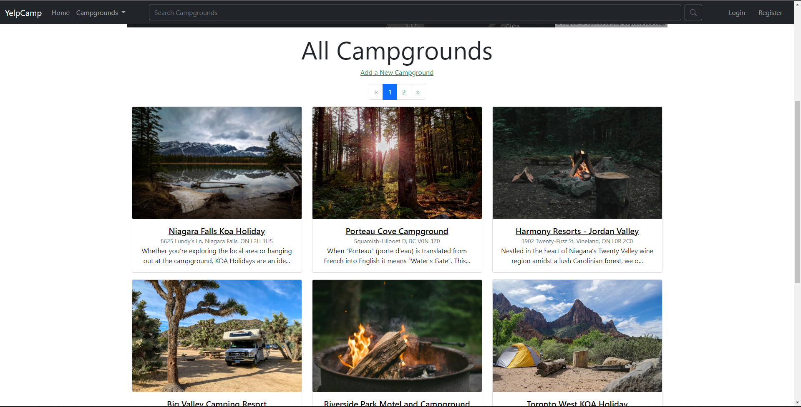

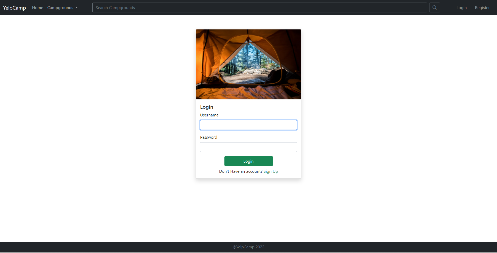

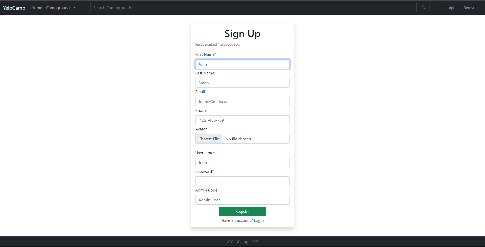

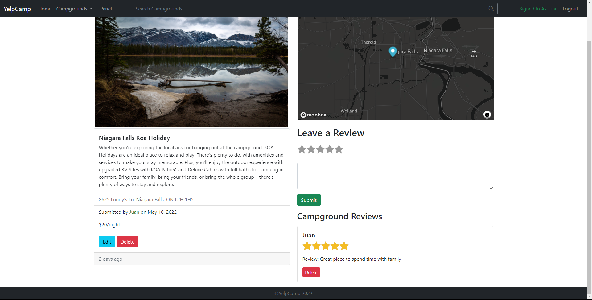

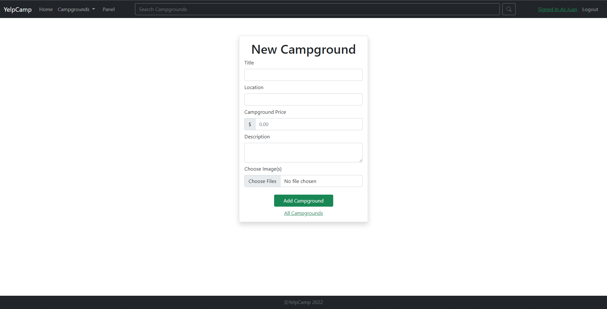

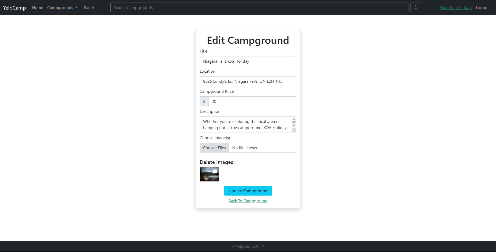

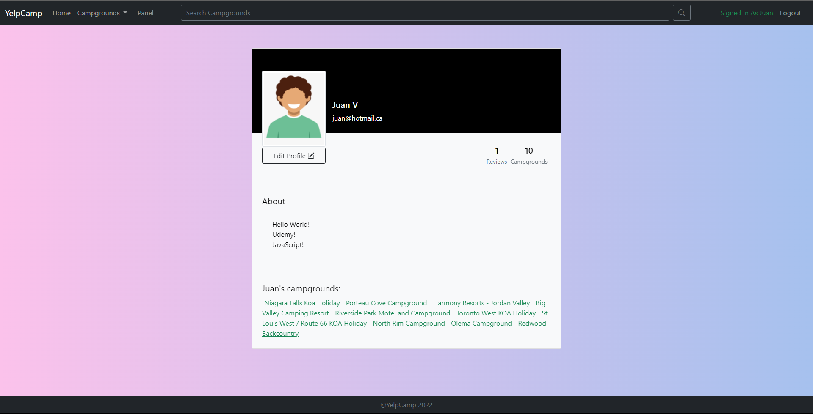

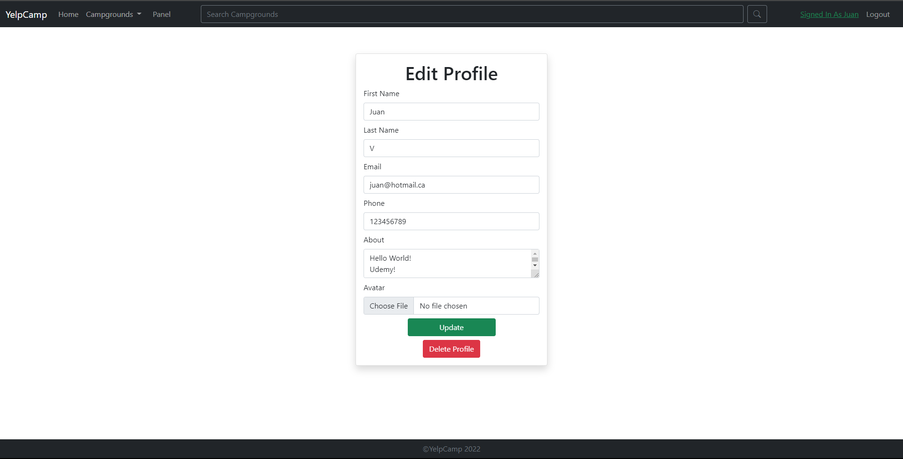

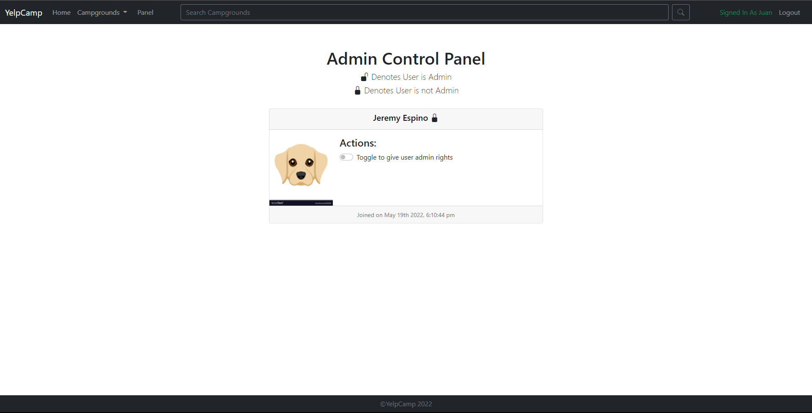

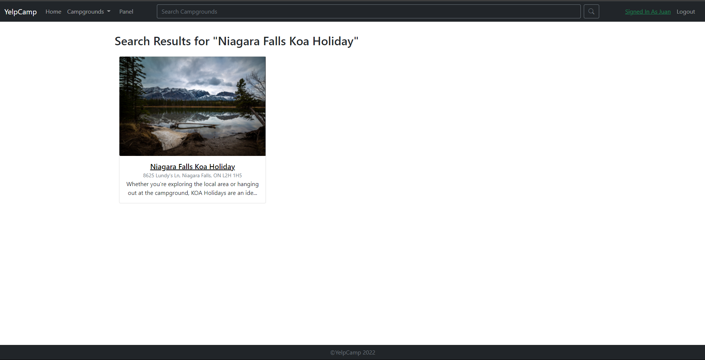
